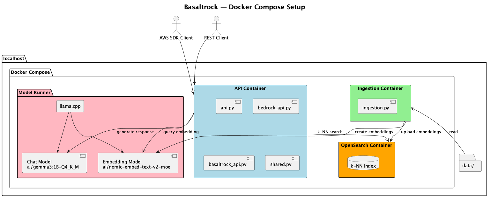

# Docker Setup

## Architecture

Services:
- **OpenSearch** — k-NN vector search
- **Ingestion** — embeds data files and indexes into OpenSearch
- **API** — FastAPI serving Bedrock-compatible endpoints

## API Endpoints

See [BEDROCK_API_COMPATIBILITY.md](BEDROCK_API_COMPATIBILITY.md) for full list.

## Environment Variables

| Variable | Default | Description |
|----------|---------|-------------|
| `MODEL_RUNNER_BASE_URL` | - | Model runner endpoint |
| `MODEL_RUNNER_LLM_CHAT` | `ai/gemma3:1B-Q4_K_M` | Chat model |
| `MODEL_RUNNER_LLM_EMBEDDING` | `ai/nomic-embed-text-v2-moe` | Embedding model |
| `KNOWLEDGE_BASE_ID` | `basaltrock-knowledge-base-id` | Knowledge base identifier |
| `MIN_SCORE` | `0` | Min similarity score for retrieval |
| `MIN_SCORE_FOR_ANSWER` | `0.3` | Min score to generate answer |
| `MAX_SIMILARITIES` | `30` | Max results to return |
| `TEMPERATURE` | `3` | Chat temperature |
| `MAX_TOKENS` | `4096` | Max tokens for response |
| `RAG_SYSTEM_PROMPT_TEMPLATE` | (see docker-compose.yml) | System prompt, use `{context}` placeholder |
| `GUARDRAIL_BLOCKED_WORDS` | (empty) | Comma-separated words to block in ApplyGuardrail |

## Supported Data Formats

`*.txt`, `*.md`, `*.html`, `*.htm`, `*.pdf`, `*.doc`, `*.docx`, `*.xls`, `*.xlsx`, `*.csv`

## Ports

| Service | Internal | External |
|---------|----------|----------|
| API | 8080 | 80 |
| OpenSearch | 9200 | 9200 |