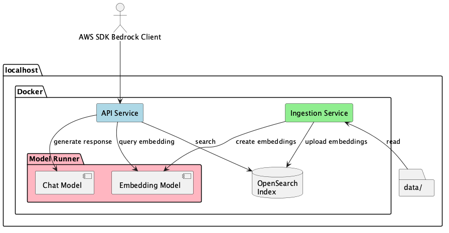
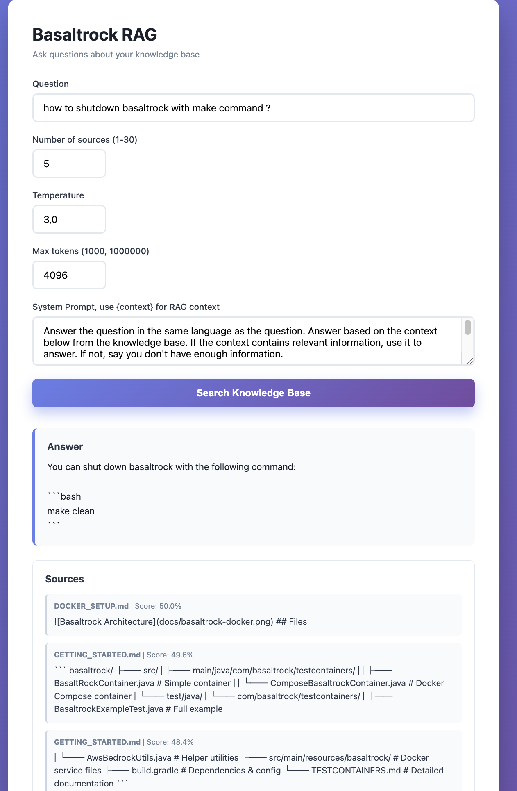

# Basaltrock

[](https://openjdk.org/)
[](LICENSE)
[](https://www.docker.com/)
[](https://jitpack.io/#bohdanartiushenko/basaltrock)

A local, Docker-based test container for knowledge based chat systems that mimics the AWS Bedrock API.



## Features

- Testcontainers Integration (JUnit 5)
- AWS Bedrock SDK Compatibility
- OpenSearch k-NN vector search backend

## Quick Start

```bash
make build                              # compile, test, build docker
make up DATA_FOLDER=/path/to/data       # start RAG service
make help                               # see all commands
```

Then open **http://localhost:80**.



## Testcontainer Usage

See [TESTCONTAINERS.md](TESTCONTAINERS.md) for details.

```java
@Testcontainers
public class MyTest {
    
    @Container
    static TempComposeBasaltrockContainer ragContainer = 
        new TempComposeBasaltrockContainer("src/test/resources/data");
    
    @Test
    public void testRAG() {
        try (var client = BedrockRuntimeAsyncClient.builder()
                .endpointOverride(URI.create(ragContainer.getBaseUrl()))
                .credentialsProvider(StaticCredentialsProvider.create(
                    AwsBasicCredentials.create("dummy", "dummy")))
                .region(Region.US_EAST_1)
                .build()) {
            
            // Your test code here
        }
    }
}
```

## Requirements

- Docker (with Model Runner support)
- Make
- Java 21+

### Minimum Hardware Requirements

| Component | RAM | GPU VRAM | Disk | CPU core @ 4.5 GHz (peak, during single query, % of 1 core) | GPU core @ 1.6 GHz (peak, during single query, % of device) |
|-----------|-----|----------|------|-------------------------------------------------------------|-------------------------------------------------------------|
| OpenSearch 2.11.0 | 1.3 GB | — | ~1 GB (image + indices) | ~2-4% | — |
| `ai/gemma3:1B-Q4_K_M` (chat) | 29 MB | 827 MB | 769 MB | <1% | ~90-94% |
| `ai/nomic-embed-text-v2-moe` (embedding) | 29 MB | 907 MB | 913 MB | <1% | ~60% |
| API service | 105 MB | — | ~200 MB | <1% | — |
| Ingestion service | ~256 MB | — | ~200 MB | — | — |
| **Total** | **~1.8 GB** | **~1.7 GB** | **~3.2 GB** | | |

Single query (200 tokens response): ~5 seconds end-to-end with GPU offload.


## Documentation

- **[GETTING_STARTED.md](GETTING_STARTED.md)** - Quick start guide
- **[TESTCONTAINERS.md](TESTCONTAINERS.md)** - Testcontainers documentation
- **[DOCKER_SETUP.md](DOCKER_SETUP.md)** - Docker setup and configuration
- **[examples/](examples/)** - Standalone examples
- **[BEDROCK_API_COMPATIBILITY.md](BEDROCK_API_COMPATIBILITY.md)** - Supported AWS Bedrock API operations

## Talks & Demos

- [How to run LLM + KB locally](https://youtu.be/Ds_qU_8cmQs) (Ukrainian)

## License

See [LICENSE](LICENSE).

## Copyright
Copyright (c) 2025-2026 [Bohdan Artiushenko](https://www.linkedin.com/in/bohdan-artiushenko-228a364/).